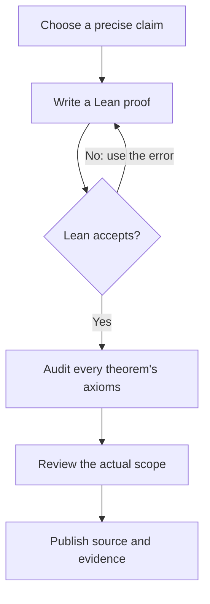

# Erdős 3 · A small step toward infinity

**Sundai Hack 142 · Harvard Innovation Labs · September 27, 2026**

[Interactive GitHub Pages lab](https://wilsonwu-ai.github.io/sundai-erdos-3/) · [Lean source](lean/Erdos3SpecialCases.lean) · [Executed verification](artifacts/lean-verification.json) · [Independent review](docs/independent-review.md)

**The full Erdős Problem 3 is not solved here.** This project delivers 14 machine-checked elementary theorem declarations, a reproducible local proof workflow, the exact AutoLab hill snapshot, and an interactive explanation. The proofs formalize known special cases and supporting lemmas; they are not 14 new mathematical discoveries or a passing AutoLab submission. The [primary problem database](https://github.com/teorth/erdosproblems/blob/main/data/problems.yaml) and [Formal Conjectures statement](https://github.com/google-deepmind/formal-conjectures/blob/a24e30f9c7767245a5030e210f40c28487dae5c5/FormalConjectures/ErdosProblems/3.lean) mark the full conjecture open at retrieval.

## Situation — one Sunday, an infinite question

At [Sundai Hack 142](https://www.sundai.club/events/boston/recursive-learning-hack-with-harvard-innovation-labs), we set out to investigate Erdős 3 using AI-assisted proof development, Lean, and AutoLab. The event's slides emphasize exact claims, reusable formal artifacts, and review. [Context and source inventory](docs/context.md).

**Explain it like I'm five:** imagine choosing numbered stepping stones. A pattern is a few stones with exactly the same gap between neighbors: `5, 11, 17, 23, 29` has gap `6`. For every chosen number `a`, put `1/a` in a jar. If the total can grow past every ceiling, Erdős 3 asks whether you can always find patterns as long as you want.

The jar is an infinite mathematical sum. A large total on a computer screen does not establish that it grows without bound.

## Task — preserve the actual target

[AutoLab's `ottogin/erdos-3`](https://app.autolab.ai/hills/ottogin/erdos-3) asks for a proof body completing a fixed statement. It uses Lean **4.33.1**, a pinned Mathlib image, and a binary `proved` score. It is a different problem from the Erdős 13 description pasted into the initial brief.

In ordinary language: every set of natural numbers whose reciprocal series is not summable contains arithmetic progressions of arbitrarily large length. Lean treats division by zero as zero; including or removing `0` does not change convergence. The educational interface uses positive integers.

The exact statement, downloaded bytes, source hashes, image digest, evaluator, and command details are preserved in [the AutoLab report](research/autolab.md). The source marker `answer(sorry)` is not an admitted proof by itself: the relevant upstream answer elaborator defaults it to `True` in this proposition context. We checked that behavior in a [minimal reproduction](research/math/AnswerDefaultRepro.lean). We did not extract or execute the exact container image.

## Action — a local loop with an independent checker

AI proposes a candidate; Lean checks the encoded claim; the axiom audit and human-readable scope review determine what can be reported. Failed checks inform the next attempt.



The diagram describes the implemented local verification workflow; it does not claim that a hosted AutoLab climb ran. [Editable diagram](docs/proof-loop.mmd) · [Rendered diagram](docs/proof-loop.svg).

We used a dependency graph to run mathematical research, hill recovery, and environment inspection concurrently. A separate worker built the visualization; the coordinator and an independent reviewer checked the final artifacts. File ownership prevented conflicting edits. [Execution graph and token-conscious strategy](docs/graph-plan.md).

Run the checked results with a Lean 4.33.1 installation:

```sh
git clone https://github.com/wilsonwu-ai/sundai-erdos-3.git
cd sundai-erdos-3
elan toolchain install leanprover/lean4:v4.33.1
python3 scripts/verify_lean.py
python3 scripts/test_verifier.py
node --test tests/explorer.test.mjs
python3 -m http.server 8000 --directory site
```

Open `http://localhost:8000`. Set `LEAN=/absolute/path/to/lean` if using a standalone compiler. This local proof artifact imports only `Std`; no Mathlib download is needed. CI independently downloads Lean 4.33.1, verifies the release checksum, reruns the proofs and negative controls, tests the finite explorer, then publishes Pages only after checks pass.

AutoLab's full hill requires its own exact image and dependencies. The local `autolab hills pull` recovered the source, but evaluation could not start because no supported container runtime was installed. No hosted climb, paid model request, official submission, or official score was produced. [Reproduction instructions and limits](research/autolab.md).

## Result — what actually passed

| Claim | Result |
| --- | --- |
| Full divergent-reciprocal-sum conjecture | **Not proved** |
| Every cofinite set contains progressions of every finite length | Lean checked |
| Every set containing a tail of a positive-step infinite progression contains all finite lengths | Lean checked |
| Multiples of a positive integer contain all finite lengths | Lean checked |
| Every unbounded natural-number set contains a nonconstant two-term progression | Lean checked |
| Powers of two are unbounded but contain no nonconstant three-term progression | Lean checked |
| Positive-step terms are distinct; progressions pass to supersets and shorter lengths | Lean checked |
| Official AutoLab hill acceptance | Not run; no score |

All 14 local declarations compile on **Lean 4.33.1**, with axiom sets contained in `{propext, Classical.choice, Quot.sound}`. There are no admitted proofs, custom axioms, or `native_decide` in the checked artifact. Negative controls reject an admitted proof, an invented axiom, an invalid proof, and a missing axiom report.

The powers-of-two result is a useful failure of a tempting shortcut: **unboundedness alone does not force long progressions**. It is not a counterexample to Erdős 3; their reciprocal series converges to `2`. That convergence fact is explanatory mathematics, not one of this repository's Lean proofs.

Our dependency-free predicate `ContainsAP A k` gives explicit witnesses `a`, `d > 0`, and all terms `a + i*d` for `i < k`. A separate theorem verifies strict increase. We have **not** formalized the bridge to the hill's `Set.IsAPOfLength`, its summability hypothesis, or its filter formulation. [Definitions and exact proof scope](lean/README.md).

The website visualizes finite sets up to 300 and lets you inspect equal-gap patterns, reciprocal partial sums, and a general multiples construction. Its JavaScript is an educational finite search, not a Lean kernel or a proof of an infinite statement.

## Where further proof work starts

The three-term divergent-sum case is known through [Bloom and Sisask's result](https://arxiv.org/abs/2007.03528). The unrestricted conjecture is much stronger. A potentially useful route is to formalize a summability reduction from sufficiently strong bounds on progression-free sets, then discharge the mathematical bound separately. Existing weaker density bounds do not automatically provide it. [Research routes, citations, and limits](research/math-status.md).

A next contribution should bridge our witness predicate to the hill's definitions or formalize a genuine missing analytic lemma. Neither change alone settles Erdős 3. Preserve the original theorem, exact environment, and axiom policy when attempting a full submission.

## Attribution

Project owner: **Wilson Wu**. Built with AI-assisted research, Lean proof development, independent review, and interface implementation during the Sundai session. Original source snapshots retain their authors' notices. The mathematical special cases are elementary known facts; no novelty claim is made. [Verification and graph retrospective](docs/verification.md).
