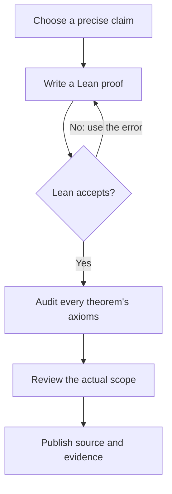

# Erdős 3 · A small step toward infinity

**Sundai Hack 142 · Harvard Innovation Labs · September 27, 2026**

[Interactive GitHub Pages lab](https://wilsonwu-ai.github.io/sundai-erdos-3/) · [Lean source and scope](lean/README.md) · [Pinned-image verification](artifacts/mathlib-verification.json) · [Independent review](docs/independent-review.md)

**The full Erdős Problem 3 is not solved here.** Earlier work proved the dyadic counting-to-summability step in Lean, but did not prove the required bounds for progression-free sets. [Attempt, checked result, and precise gaps](research/proof-attempt-2026-09-27.md). The project now contains 57 checked supporting declarations. The original 30 are 14 elementary results, five definition bridges, three divergence consequences, four block estimates, two analytic transfers, and two explicitly conditional reductions. **The newest 22 prove that the exact hill is equivalent to a classical extremal statement:** for every k ≥ 4, the series ∑ⱼ rₖ(2ʲ)/2ʲ converges, where rₖ(N) is the imported library's largest k-progression-free subset of {1,…,N}. Neither side of that equivalence is proved. Five more show that the published three-term bounds (Kelley–Meka, or the weaker Bloom–Sisask form) imply Formal Conjectures' three-term case; the bounds themselves are not yet formalized. These are known facts and proof infrastructure, with no claim of a new solution. The [primary problem database](https://www.erdosproblems.com/3) and [Formal Conjectures statement](https://github.com/google-deepmind/formal-conjectures/blob/a24e30f9c7767245a5030e210f40c28487dae5c5/FormalConjectures/ErdosProblems/3.lean) mark the full conjecture open at retrieval.

The [full-proof graph and research round](research/full-proof-graph/README.md) tested cross-scale estimates and induction on progression length. It refuted two shortcuts and justified the extremal-summability reduction in ordinary mathematics. A follow-up round [kernel-checked that equivalence against the verbatim hill statement](research/full-proof-graph/extremal-equivalence.md). The decisive estimate remains open. For k = 4, the best published bound is N(log N)⁻ᶜ with an unspecified small c. Convergence needs c > 1.

## Situation — one Sunday, an infinite question

At [Sundai Hack 142](https://www.sundai.club/events/boston/recursive-learning-hack-with-harvard-innovation-labs), we set out to investigate Erdős 3 using AI-assisted proof development, Lean, and AutoLab. The event's slides emphasize exact claims, reusable formal artifacts, and review. [Context and source inventory](docs/context.md).

**Explain it like I'm five:** imagine choosing numbered stepping stones. A pattern is a few stones with exactly the same gap between neighbors: `5, 11, 17, 23, 29` has gap `6`. For every chosen number `a`, put `1/a` in a jar. If the total can grow past every ceiling, Erdős 3 asks whether you can always find patterns as long as you want.

The jar is an infinite mathematical sum. A large total on a computer screen does not establish that it grows without bound.

## Task — preserve the actual target

[AutoLab's `ottogin/erdos-3`](https://app.autolab.ai/hills/ottogin/erdos-3) asks for a proof body completing a fixed statement. It uses Lean **4.33.1**, a pinned Mathlib image, and a binary `proved` score. It is a different problem from the Erdős 13 description pasted into the initial brief.

In ordinary language: every set of natural numbers whose reciprocal series is not summable contains arithmetic progressions of arbitrarily large length. Lean treats division by zero as zero; including or removing `0` does not change convergence. The educational interface uses positive integers.

The exact statement, downloaded bytes, source hashes, image digest, evaluator, and command details are preserved in [the AutoLab report](research/autolab.md). The source marker `answer(sorry)` is not an admitted proof by itself: the imported answer elaborator defaults it to `True` in this proposition context. We checked that behavior first in a [minimal reproduction](research/math/AnswerDefaultRepro.lean), then [inside the exact container image](artifacts/local-evaluator-verification.json).

## Action — a local loop with an independent checker

AI proposes a candidate; Lean checks the encoded claim; the axiom audit and human-readable scope review determine what can be reported. Failed checks inform the next attempt.



The diagram describes the implemented local verification workflow; it does not claim that a hosted AutoLab climb ran. [Editable diagram](docs/proof-loop.mmd) · [Rendered diagram](docs/proof-loop.svg).

We used a dependency graph to run mathematical research, hill recovery, and environment inspection concurrently. A separate worker built the visualization; the coordinator and an independent reviewer checked the final artifacts. File ownership prevented conflicting edits. [Execution graph and token-conscious strategy](docs/graph-plan.md).

Run the checked results with a Lean 4.33.1 installation:

```sh
git clone https://github.com/wilsonwu-ai/sundai-erdos-3.git
cd sundai-erdos-3
elan toolchain install leanprover/lean4:v4.33.1
python3 scripts/verify_lean.py
python3 scripts/test_verifier.py
node --test tests/explorer.test.mjs
python3 -m http.server 8000 --directory site
```

Open `http://localhost:8000`. Set `LEAN=/absolute/path/to/lean` if using a standalone compiler. The original fourteen results import only `Std`; that check needs no Mathlib download. CI independently checks those results and the finite explorer, while a second job compiles all 57 declarations in the pinned image. Pages deployment requires both jobs to pass.

AutoLab's full hill now runs locally in its exact pinned image using a dedicated Colima/Docker VM with Rosetta for AMD64. The unchanged hill's local tree hash matches the published origin. A small imported-library proof compiled, the original `sorry` baseline was correctly rejected, and its local report signature verified. [Environment setup, daily commands, and limits](docs/local-evaluator.md).

To begin work on the actual hill, edit `submissions/current/solution.lean` and run:

```sh
python3 scripts/local_evaluator.py start
python3 scripts/local_evaluator.py check-lean
python3 scripts/local_evaluator.py eval submissions/current
```

`check-lean` verifies the supporting modules and saves their source hashes and axiom audits. The full-hill attempt now reduces the goal to reciprocal summability for a progression-free set, then intentionally fails at that unproved step. Each attempt uses the fixed original statement; reports are saved under `.local-evaluator/reports/`. [Current remaining proof state](artifacts/reduction-attempt.json). No hosted climb, paid model request, submission, or leaderboard score was produced for `ottogin/erdos-3`. A separate, clearly labelled hill for the proved equivalence, [`wilsonwu-ai/erdos-3-extremal-equivalence`](https://app.autolab.ai/hills/wilsonwu-ai/erdos-3-extremal-equivalence), passed with a real submission; see below.

## Result — what actually passed

| Claim | Result |
| --- | --- |
| Full divergent-reciprocal-sum conjecture | **Not proved** |
| Every cofinite set contains progressions of every finite length | Lean checked |
| Every set containing a tail of a positive-step infinite progression contains all finite lengths | Lean checked |
| Multiples of a positive integer contain all finite lengths | Lean checked |
| Every unbounded natural-number set contains a nonconstant two-term progression | Lean checked |
| Reciprocal non-summability implies infinitude, unboundedness, and an exact two-term progression | Lean checked in the pinned image |
| Powers of two are unbounded but contain no nonconstant three-term progression | Lean checked |
| Positive-step terms are distinct; progressions pass to supersets and shorter lengths | Lean checked |
| Elementary witnesses imply `Set.IsAPOfLength`; all lengths imply the exact filter conclusion | Lean checked in the pinned image |
| AP-free reciprocal summability would imply the full hill | Conditional reduction checked; its assumption is unproved |
| Summable normalized dyadic block counts imply summable reciprocals | Lean checked in the pinned image |
| A normalized block-count bound C/(j+1)ᵖ with p>1 implies summability | Lean checked; the required AP-free bound remains unproved |
| Exact hill ⟺ ∑ⱼ rₖ(2ʲ)/2ʲ < ∞ for every k ≥ 4, with rₖ the library's `maxCard` | Lean checked in the pinned image; neither side proved |
| For k ≥ 4, k-free subsets of the blocks [4ʲ, 2·4ʲ) always have a k-free union | Lean checked in the pinned image |
| Formal Conjectures' `kelley_meka` variant (or the weaker Bloom–Sisask bound) implies its `three` variant | Lean checked in the pinned image; the bound itself is not formalized |
| Official AutoLab acceptance for `ottogin/erdos-3` | Not submitted; no score (the proof is incomplete) |
| AutoLab hill for the proved equivalence: [`wilsonwu-ai/erdos-3-extremal-equivalence`](https://app.autolab.ai/hills/wilsonwu-ai/erdos-3-extremal-equivalence) | **Passed**: `proved = 1`, #1 on its leaderboard. This is a different theorem from Erdős 3 |
| Local original-hill evaluator | Ready; pinned image, matching tree, baseline rejection verified |

All 57 declarations compile on **Lean 4.33.1** in the pinned image, with axiom sets contained in `{propext, Classical.choice, Quot.sound}`. There are no admitted proofs, custom axioms, or `native_decide` in those modules. The conditional reductions retain `APFreeSummability` and `APFreePowerEnvelope` as explicit theorem parameters; passing an axiom audit does not prove those parameters. Negative controls reject an admitted proof, an invented axiom, an invalid proof, and a missing axiom report.

The powers-of-two result is a useful failure of a tempting shortcut: **unboundedness alone does not force long progressions**. It is not a counterexample to Erdős 3; their reciprocal series converges to `2`. That convergence fact is explanatory mathematics, not one of this repository's Lean proofs.

Our dependency-free predicate `ContainsAP A k` gives explicit witnesses `a`, `d > 0`, and all terms `a + i*d` for `i < k`. The new bridge proves these witnesses satisfy `Set.IsAPOfLength` with exactly `k` distinct elements, including `k=0`. Cofinite and affine-tail special cases now produce the hill's exact filter conclusion. A separate module derives infinitude and a two-term progression from the actual summability hypothesis. [Definitions and exact proof scope](lean/README.md).

The website visualizes finite sets up to 300 and lets you inspect equal-gap patterns, reciprocal partial sums, and a general multiples construction. Its JavaScript is an educational finite search, not a Lean kernel or a proof of an infinite statement.

## Where further proof work starts

**[The roadmap](research/roadmap.md)** sets out the plan: what any proof must contain, why current methods stop, and three goals ordered by feasibility. Goal A, a Lean proof of the known k = 3 case in Formal Conjectures' exact statement, is under way.

The three-term divergent-sum case is known through [Bloom and Sisask's result](https://arxiv.org/abs/2007.03528). The unrestricted conjecture is much stronger. A potentially useful route is to formalize a summability reduction from sufficiently strong bounds on progression-free sets, then discharge the mathematical bound separately. Existing weaker density bounds do not automatically provide it. [Research routes, citations, and limits](research/math-status.md).

The dyadic transfer and its converse are now formalized: the hill is Lean-checked equivalent to convergence of ∑ⱼ rₖ(2ʲ)/2ʲ for every k ≥ 4. The remaining task is purely a counting bound. For each fixed k, a bound rₖ(N) ≪ N/(log N)ᶜ with c > 1 would suffice. The best published bounds do not reach that threshold:

| Length | Best published bound | Enough? |
| --- | --- | --- |
| k = 3 | N·exp(−c(log N)^(1/9)) (Bloom–Sisask 2023, after Kelley–Meka) | Yes, but the hill needs every k |
| k = 4 | N(log N)⁻ᶜ, c > 0 unspecified and small (Green–Tao 2017) | Only if c > 1 |
| k ≥ 5 | N·exp(−(log log N)^(cₖ)) (Leng–Sah–Sawhney 2024) | Not known |

These were checked against primary sources on 27 September 2026, with every citation re-fetched by an independent skeptic. [Obstacle, sources and verdicts](research/full-proof-graph/extremal-equivalence.md). The earlier attempt tested three approaches, identified their missing hypotheses, and rejected a false multiplicative shortcut by a finite counterexample. Preserve the original theorem, exact environment, and axiom policy when attempting a full submission.

## Attribution

Project owner: **Wilson Wu**. Built with AI-assisted research, Lean proof development, independent review, and interface implementation during the Sundai session. Original source snapshots retain their authors' notices. The mathematical special cases are elementary known facts; no novelty claim is made. [Verification and graph retrospective](docs/verification.md).
