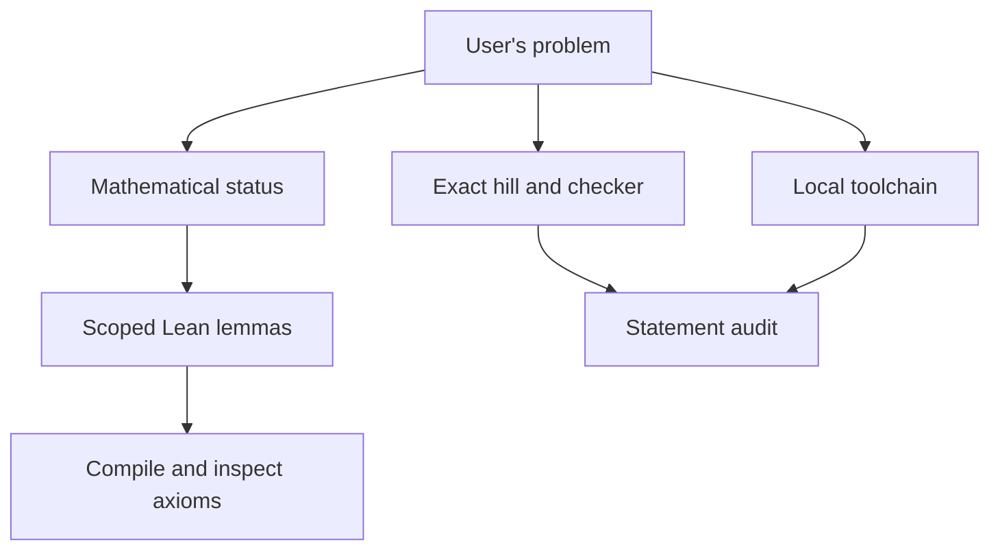
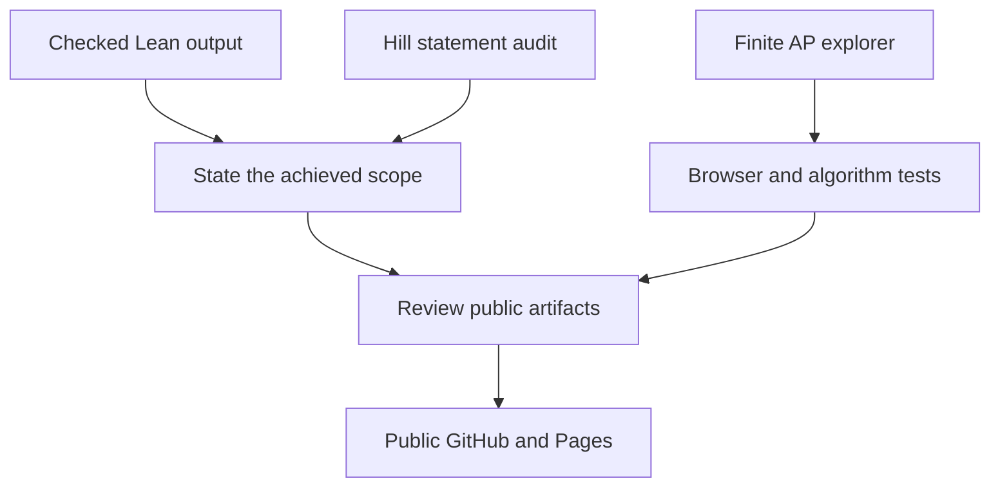

# The execution graph

This is the graph actually used for the September 27, 2026 Sundai Hack 142 session. The user authorized planning, agent execution, a public personal GitHub repository, and GitHub Pages publication.

## Remove false dependencies

| Task pair | Reads the other's output? | Decision |
| --- | --- | --- |
| Research mathematical status / recover AutoLab hill | No | Run concurrently |
| Recover hill / inspect installed Lean and GitHub | No | Run concurrently |
| Build visual finite experiment / prove local lemmas | Only final result labels | Develop separately; join before publication |
| Evaluate exact hill / recover its statement and checker | Yes | Real dependency |
| Announce proof / compile and audit it | Yes | Real dependency |
| Publish / inspect staged files and result claims | Yes | Real dependency |

Shared writes are avoided: `math_research` owns `research/math*` and `lean/`; `autolab_recon` owns `research/autolab*`; `pages_demo` owns `site/`; the coordinator owns scripts, documentation, integration, and publication. Only the coordinator commits and pushes.



The second graph separates proof evidence from a finite demonstration.



## Graph specification

```text
GOAL: A reproducible Erdős 3 research project, checked local results, and honest public demo.
FAN OUT: Mathematical research, hill/interface recovery, and environment work are independent.
CONTRACT: Each worker returns paths, exact claims, evidence, verification, and blockers.
ANCHOR: Primary sources; downloaded hill bytes; actual Lean output; browser observations.
VERIFY: Coordinator reruns Lean and axiom checks; cross-review of hill placeholder; UI tests.
REDUCE: Keep sourced status, passing theorems, reproducible failures, and working interactions.
CAP: Three delegated tasks; four active agents including coordinator; no nested agents.
REPORT: Links, exact achieved scope, checks, remaining original-problem blockers.
HUMAN GATE: Public repo and Pages already authorized. No paid cloud climb authorized.
FROZEN: Original hill statement, axiom whitelist, and distinction between examples and proof.
```

Planning estimate: parallel fraction `p = 0.7`, three independent tracks `N = 3`; Amdahl speedup `1 / (0.3 + 0.7/3) ≈ 1.88`; theoretical ceiling `3.33`. Integration and verification still take sequential time. Maximum fan-in is three concise worker reports. Workers inherit the session model and reasoning tier; no additional external model API is used. A soft planning allowance is approximately 8,000 tokens per delegated task (24,000 total) plus coordinator integration; this is an estimate, not a runtime-enforced budget or measured bill. Workers are bounded by outputs and probes rather than recursive spawning.

The first pass searches at most eight primary math sources and about ten interface probes; broaden only when a concrete blocker warrants it. Cache downloaded context, batch independent reads, and test small changes locally before requesting more model reasoning.

## Continuation: proof bridges in the pinned image

After the local evaluator was ready, the next fan-out assigned disjoint files:

| Owner | Bounded output | Dependency |
| --- | --- | --- |
| `math_research` | `lean/Erdos3Divergence.lean`: consequences of reciprocal divergence | Actual imported summability and AP definitions |
| `autolab_recon` | `lean/Erdos3Bridge.lean`: connect explicit witnesses to the hill | Original 14 elementary results and actual AP definitions |
| `pages_demo` | Read-only recommendation for the next analytic reduction | Archived mathematical status and library source |
| Coordinator | Container module checker, integration, public evidence | Both proof files must compile and pass axiom audits first |

All proof workers use the cached original image. There is no nested fan-out or external model call. The existing scopes are held fixed until compiler evidence supports a change. The next meaningful mathematical obstacle, rather than an arbitrary number of attempts, determines where this continuation stops.

The resumed workers retained a sandbox that could not access the Docker socket. The coordinator extracted the pinned library sources into an ignored local directory and ran compilation centrally. The coordinator also took over the short divergence module; the mathematical worker then reviewed it independently. The bridge worker delivered five theorems, and the read-only reviewer checked both the bridge and the conditional reduction. Final aggregate compilation and all 23 axiom audits passed. This adjustment avoids further blocked worker-side runtime calls.
