# Full-proof graph: attempted, not completed

**No full proof of Erdős 3 was obtained.** This round attacked the missing mathematical obligation with two independent routes and a separate reviewer. It produced explicit counterexamples to proposed shortcuts and an elementary proof of a useful equivalence. Neither route supplied the required summability estimate. The [primary status record](https://github.com/teorth/erdosproblems/blob/main/data/problems.yaml) still marks problem 3 open, checked on 27 September 2026.

The existing **30 Lean-checked supporting declarations are unchanged**. All new mathematical arguments in this directory are written proofs reviewed by agents, not Lean kernel certificates. No passing full-hill submission or AutoLab score was produced.

## What the proof graph actually requires



[Editable Mermaid source](proof-obligations.mmd). Arrows show logical dependencies. A checked implication does not establish its premise. In this diagram, k ranges over integers at least three, and “k-free” means containing no arithmetic progression of k distinct terms.

For each fixed k and each k-free A, define the positive dyadic blocks

$$
B_j=A\cap[2^j,2^{j+1}),\qquad c_j=|B_j|/2^j.
$$

The open input is `Summable (fun j => c_j)`. The existing [analytic transfer](../../lean/Erdos3Dyadic.lean) would then prove reciprocal summability. The existing [contrapositive reduction](../../lean/Erdos3Reduction.lean) converts this result for all fixed lengths into the exact hill. Zero contributes only a finite exception, with reciprocal zero under Lean's convention.

There is no need to prove a common bound C/(j+1)ᵖ with p>1. That earlier sufficient target was stronger than necessary. This round instead examined the pointwise summability obligation directly.

## Route results

| Proposed route or lemma | Result | Evidence |
| --- | --- | --- |
| Freeze one difference and keep extending progressions | **Refuted.** A divergent-reciprocal set can have only finitely many pairs at each fixed gap. | [Construction and proof](length-induction.md), [exact finite checks](../../artifacts/fixed-gap-counterexample.json) |
| Use a three-term progression of starts to obtain a four-term progression | **Refuted.** A seven-element counterexample works; finite base-five cubes defeat any fixed nesting depth. | [Proof and witnesses](length-induction.md), [finite enumeration](../../artifacts/proof-candidate-checks.json) |
| Progression starts retain divergent mass, assuming the length-k theorem | **Valid conditional argument.** It does not synchronize their differences. | [Complement argument](length-induction.md) |
| Force restrictions from interactions between widely separated blocks | **Obstructed.** For k≥4, independently chosen k-free subsets of [4ʲ,2·4ʲ) have a k-free union. | [Separated-block proof](cross-scale.md), [independent review](review.md) |
| Bound the total normalized size of those independent blocks | **Open.** It is equivalent to fixed-k reciprocal summability. | [Equivalence with all quantifiers justified](cross-scale.md) |

The cross-scale argument is constructive. Choose a largest k-free subset in each finite block and combine them. No new k-term progression can cross the gaps for k≥4. Consequently, the missing estimate is exactly

$$
\sum_{j\ge0}\frac{r_k(4^j)}{4^j}<\infty,
$$

where rₖ(N) is the largest size of a k-free subset of {1,…,N}. The report proves the equivalence in ordinary mathematics. It does **not** prove convergence. No novelty is claimed for these elementary reductions or counterexamples.

## Executed agent graph



[Editable Mermaid source](execution.mmd).

```text
GOAL: Close the actual Erdős 3 hill, or identify precisely where this bounded attempt fails.
FAN OUT: Cross-scale estimates and induction on length are independent mathematical attacks.
CONTRACT: Exact quantifiers; implication to target; proof, counterexample, or explicit open premise.
ANCHOR: Original fixed hill, existing Lean evidence, and fully specified integer examples.
VERIFY: Independent argument review; exact rational/integer checks; full Lean gate if a proof emerges.
REDUCE: Preserve justified arguments; reject false shortcuts; never promote an open assumption.
CAP: Two research workers + one reviewer; no nested agents, Docker workers, or external model calls.
REPORT: Source, rendered diagrams, reproducible checks, remaining obligation, and publication status.
HUMAN GATE: Agent execution and public GitHub/Pages were already authorized by the user.
FROZEN: Original theorem, pinned toolchain, axiom whitelist, and proof-versus-experiment distinction.
```

The fake-edge check allows both research routes to start immediately. Their final review and falsification depend on their actual candidate statements; those are real edges. Shared writes were separated: the research workers own `cross-scale.md` and `length-induction.md`, the reviewer owns `review.md`, and the coordinator owns diagrams, scripts, integration, and publication. Only the coordinator commits.

Planning estimate: parallel fraction p=0.7 with three worker roles gives speedup 1/(0.3+0.7/3)≈1.88 and ceiling 3.33. Review has a sequential join, so this is an optimistic planning estimate, not measured acceleration. Maximum fan-in is three concise reports. Soft allowances were about 5,000 tokens per research worker and 4,000 for review, plus coordinator integration; these are not enforced limits or billing measurements. The run reused cached context and inherited models. No paid AutoLab climb or additional model API was launched.

## Reproduce the finite checks

```sh
python3 research/check_fixed_gap.py
python3 research/check_proof_candidates.py
```

The first uses integer bit lengths and exact fractions for eleven dyadic index blocks, through index 2047. The second exhaustively checks the seven-point witness, four base-five cubes, and progression lengths 4–8 in five complete factor-four blocks. These checks run in CI. They can refute a false universal statement with a finite witness; passing them cannot certify an infinite statement. The written proofs supply the arguments for all scales.

The next productive mathematical step must establish a new progression-free summability estimate or a different valid implication to the hill. Repeating the conditional reductions or adding agents to the same invalid inferences would not close that obligation.

```text
RUN RETRO — structural-full-proof-attempt · 2026-09-27
VERIFIER KILL RATE   2/2 explicit induction shortcuts refuted; the uniform packing premise remains open
FAN-OUT EFFICIENCY   3/3 workers returned useful, reviewed outputs; no full-proof candidate survived
COMPRESSION RATIO    2 attack routes → 1 exact open estimate, with explicit obstructions recorded
RETURNED VS SENT     3/3 worker reports, plus one bounded join review
COST                 ~14,000 soft delegated-token allowance → actual token usage and billing unavailable
```

Recommendation: narrow the next attempt to a concrete new estimate for r₄(N), with a quantitative consequence strong enough to sum across scales. Keep the current full-hill status **not proved**.
